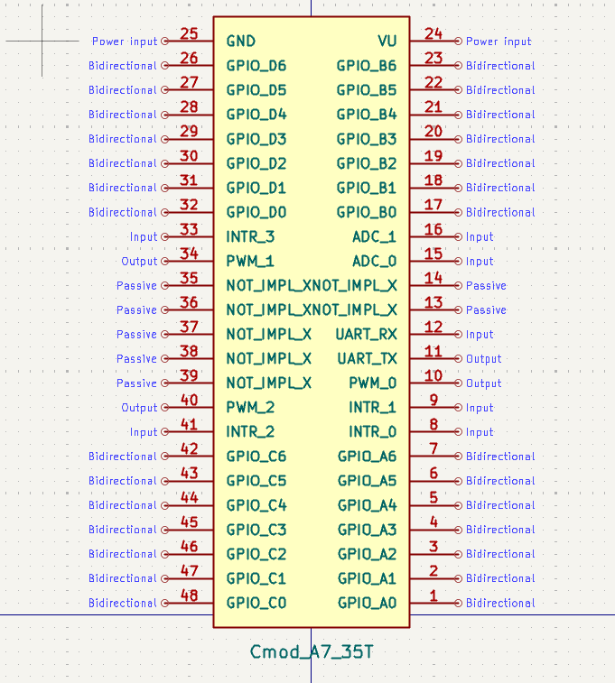

# RISC-V MCU on Cmod A7

A soft-core RISC-V MCU system built on the **Digilent Cmod A7-35T** (Xilinx Artix-7, xc7a35tcpg236-1), designed for the **NCKU Microprocessor Principles and Applications** course.

## Overview

This project provides a ready-to-use RISC-V MCU environment on the Cmod A7-35T for the **NCKU Microprocessor Principles and Applications** course. Students write and run firmware targeting a MicroBlaze RISC-V processor with a set of pre-configured peripherals, focusing on software-level interaction such as register programming, interrupt handling, and peripheral control — without needing to deal with FPGA or circuit-level details.


### System Architecture


### Key Specifications

| Item | Detail |
|------|--------|
| FPGA | Xilinx Artix-7 xc7a35tcpg236-1 |
| Processor | MicroBlaze RISC-V (32-bit, RV32IM + Bitmanip) |
| System Clock | 100 MHz (PLL from 12 MHz on-board oscillator) |
| Local Memory | 128 KB (Block RAM, 128 KB Instruction + Data, shared True Dual-Port) |
| Interconnect | AXI SmartConnect (20 peripheral ports) |
| Toolchain | Vivado & Vitis 2025.2 |



### Peripherals

- **GPIO** — 4 × 7-bit bidirectional DIP groups (A–D), on-board LEDs × 2, RGB LED, push button
- **PWM** — 3 channels (axi_timer, DIP Pin 10 / 34 / 40)
- **UART** — 2 × 16550 (USB Micro-USB + DIP Pin 11/12 external)
- **Timers** — 3 × 32-bit general-purpose (with interrupt)
- **Interrupt Controller** — 6-channel AXI INTC
- **XADC** — 12-bit ADC, 500 KSPS aggregate / 100 KSPS per channel (2 external analog inputs)
- **QSPI Flash** — On-board Quad-SPI flash
- **SRAM** — 512 KB external cellular RAM (axi_emc, 32 MB address range)

## Repository Structure

| Directory | Description |
|-----------|-------------|
| [`release/`](release/) | Pre-built outputs — `top.bit` bitstream and `top_wrapper.xsa` for direct use without rebuilding |
| [`RISC-V-MCU/`](RISC-V-MCU/) | Vivado hardware design — `top.tcl` rebuild script, IP peripheral reference |
| [`Cmod-A7-spec/`](Cmod-A7-spec/) | Board documentation — XDC constraints, pin mapping, power specs, KiCad symbol |
| [`Vitis-Software-Dev-Guide/`](Vitis-Software-Dev-Guide/) | Vitis development guides — JTAG debug mode, standalone boot mode, core concepts |
| [`workspace-example/`](workspace-example/) | Firmware examples — GPIO, PWM, UART, RISC-V assembly LED control |
| [`Intro_PPT/`](Intro_PPT/) | Course introduction slides (PDF + PPTX) |
| [`docs/`](docs/) | Project-level images and diagrams |

## Prerequisites

- **Vivado 2025.2** — for synthesizing and implementing the FPGA design, and programming the bitstream
- **Vitis 2025.2** — for creating the hardware platform and developing firmware applications

## Getting Started

The fastest way to get up and running is to use **JTAG Debug Mode** — load and run firmware directly over USB without touching flash memory.

### 1. Rebuild the Vivado Block Design

Open Vivado 2025.2 and rebuild the hardware design from the Tcl script:

```tcl
source RISC-V-MCU/top.tcl
```

This recreates the full block design, including the MicroBlaze RISC-V processor and all peripherals. After synthesis and implementation, export the hardware as an `.xsa` file for Vitis. Alternatively, use the pre-built `release/top_wrapper.xsa` directly.

### 2. Create a Vitis Platform and Application

1. Open Vitis 2025.2 and create a new platform using `release/top_wrapper.xsa`.
2. Select **standalone** OS and **microblaze_riscv_0** as the processor. Build the platform.
3. Create a new application from the **Hello World** template.
4. Copy source files from one of the examples in `workspace-example/`, or write your own.
5. Build the application to produce an `.elf` file.

### 3. Run and Debug over JTAG

1. Connect the Cmod A7-35T to your computer via USB.
2. Click **Run** in the FLOW panel — Vitis will automatically program the FPGA and execute your application.
3. Click **Debug** to enter a GDB-like interactive session with breakpoints, stepping, and register/memory inspection.

For detailed step-by-step instructions with screenshots, see the [JTAG Debug Mode Guide](Vitis-Software-Dev-Guide/JTAG-Debug-Mode/JTAG-Debug-Mode.md).

### Example Programs

The `workspace-example/` directory contains four ready-to-use test programs:

- **Btn_LED_asm_test** — Button & LED control in RISC-V assembly
- **GPIO_test** — Toggle LEDs and read button/switch inputs
- **PWM_test** — Drive a servo motor via PWM output
- **UART_test** — Send and receive data over UART

## Documentation

### MCU Design Reference

| Document | Description |
|----------|-------------|
| [IP Peripheral Reference](RISC-V-MCU/IP-Specification/Cmod_A7_IP_Peripheral_Reference.md) | Full AXI IP list, base addresses, parameters, interrupt mapping |

### Board Specification

Hardware documentation in [`Cmod-A7-spec/`](Cmod-A7-spec/):

| Document | Description |
|----------|-------------|
| [Pin Specification](Cmod-A7-spec/Pin-Specification/Cmod_A7_Pin_Specification.md) | DIP connector pin map, GPIO/PWM/UART/ADC assignments, electrical characteristics |
| [Power Specification](Cmod-A7-spec/Power-Specification/Cmod_A7_Power_Specification.md) | Power rails, input options, VU pin behavior, dual-supply considerations |

### Vitis Guides

Step-by-step guides for software development in [`Vitis-Software-Dev-Guide/`](Vitis-Software-Dev-Guide/):

| Guide | Description |
|-------|-------------|
| [Vitis Core Concepts](Vitis-Software-Dev-Guide/README.md) | Platform, Application, XSDB, and workflow overview |
| [JTAG Debug Mode](Vitis-Software-Dev-Guide/JTAG-Debug-Mode/JTAG-Debug-Mode.md) | Load and debug applications over JTAG |
| [Standalone Boot Mode](Vitis-Software-Dev-Guide/Standalone-Boot-Mode/Standalone-Boot-Mode.md) | Program flash for standalone boot |

## License

This project is developed for educational use at National Cheng Kung University (NCKU).
